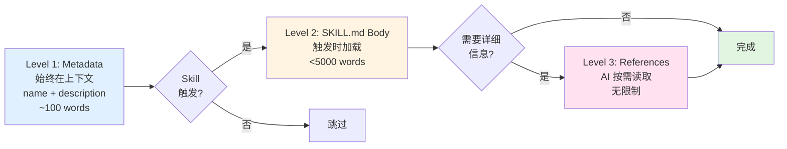
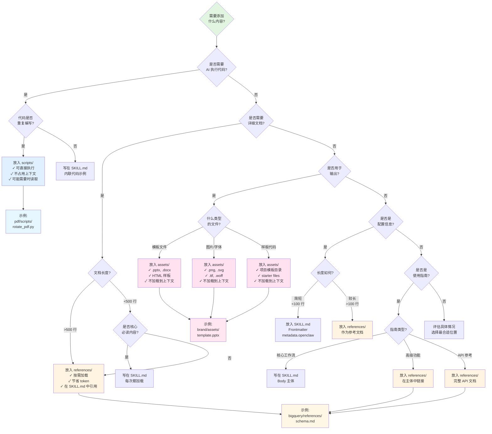

# Skill 创建流程详解与流程图

## 目录
1. [完整创建流程（六步法）](#完整创建流程六步法)
2. [技术实现流程](#技术实现流程)
3. [加载和触发流程](#加载和触发流程)
4. [资源组织决策树](#资源组织决策树)
5. [验证和打包流程](#验证和打包流程)

---

## 完整创建流程（六步法）

这是创建一个 Skill 的完整流程，从理解需求到迭代改进。

```mermaid
flowchart TD
    Start([开始创建 Skill]) --> Step1[Step 1: 理解 Skill<br/>收集具体示例]
    
    Step1 --> Q1{是否已清楚<br/>使用场景?}
    Q1 -->|否| Q1A[询问用户示例<br/>- 这个 skill 做什么?<br/>- 何时触发?<br/>- 预期输入/输出?]
    Q1A --> Q1B[收集 3-5 个<br/>具体示例]
    Q1B --> Q1
    Q1 -->|是| Step2
    
    Step2[Step 2: 规划内容<br/>分析需要的资源] --> Q2[分析每个示例:<br/>需要什么资源?]
    
    Q2 --> Decision1{需要可执行<br/>脚本?}
    Decision1 -->|是| Add1[添加 scripts/<br/>- Python/Bash 脚本<br/>- 重复使用的代码]
    Decision1 -->|否| Decision2
    Add1 --> Decision2
    
    Decision2{需要参考<br/>文档?}
    Decision2 -->|是| Add2[添加 references/<br/>- API 文档<br/>- Schema 定义<br/>- 详细指南]
    Decision2 -->|否| Decision3
    Add2 --> Decision3
    
    Decision3{需要模板<br/>或资源文件?}
    Decision3 -->|是| Add3[添加 assets/<br/>- 模板文件<br/>- 图片/字体<br/>- 样板代码]
    Decision3 -->|否| Step3
    Add3 --> Step3
    
    Step3[Step 3: 初始化 Skill<br/>运行 init_skill.py] --> Init1[执行命令:<br/>init_skill.py skill-name<br/>--path output-dir<br/>--resources scripts,references,assets<br/>--examples]
    
    Init1 --> Init2[脚本自动生成:<br/>✓ skill-name/ 目录<br/>✓ SKILL.md 模板<br/>✓ 资源目录<br/>✓ 示例文件可选]
    
    Init2 --> Step4[Step 4: 编辑 Skill<br/>实现具体内容]
    
    Step4 --> Edit1[编辑 SKILL.md<br/>Frontmatter]
    Edit1 --> Edit1A[设置 name: skill-name]
    Edit1A --> Edit1B[编写 description:<br/>- 做什么<br/>- 何时触发<br/>- 支持的场景]
    
    Edit1B --> Edit2[编辑 SKILL.md<br/>Body 内容]
    Edit2 --> Edit2A{选择结构模式}
    
    Edit2A -->|工作流式| Struct1[## Overview<br/>## Workflow Decision Tree<br/>## Step 1<br/>## Step 2]
    Edit2A -->|任务式| Struct2[## Overview<br/>## Quick Start<br/>## Task Category 1<br/>## Task Category 2]
    Edit2A -->|参考式| Struct3[## Overview<br/>## Guidelines<br/>## Specifications]
    Edit2A -->|能力式| Struct4[## Overview<br/>## Core Capabilities<br/>### 1. Feature<br/>### 2. Feature]
    
    Struct1 --> Edit3
    Struct2 --> Edit3
    Struct3 --> Edit3
    Struct4 --> Edit3
    
    Edit3[添加具体内容:<br/>- 代码示例<br/>- 使用指南<br/>- 引用资源文件]
    
    Edit3 --> Edit4{是否有<br/>scripts/?}
    Edit4 -->|是| Edit4A[实现脚本逻辑<br/>测试运行]
    Edit4 -->|否| Edit5
    Edit4A --> Edit5
    
    Edit5{是否有<br/>references/?}
    Edit5 -->|是| Edit5A[编写参考文档<br/>API/Schema/指南]
    Edit5 -->|否| Edit6
    Edit5A --> Edit6
    
    Edit6{是否有<br/>assets/?}
    Edit6 -->|是| Edit6A[准备资源文件<br/>模板/图片/字体]
    Edit6 -->|否| Step5
    Edit6A --> Step5
    
    Step5[Step 5: 打包 Skill<br/>运行 package_skill.py] --> Pack1[执行命令:<br/>package_skill.py<br/>path/to/skill-folder]
    
    Pack1 --> Validate[自动验证:]
    Validate --> V1[✓ YAML frontmatter 格式]
    V1 --> V2[✓ name 和 description 存在]
    V2 --> V3[✓ 命名规范hyphen-case]
    V3 --> V4[✓ 目录结构正确]
    V4 --> V5[✓ 资源文件引用]
    
    V5 --> VResult{验证通过?}
    VResult -->|否| VFail[显示错误信息<br/>修复后重新打包]
    VFail --> Edit3
    VResult -->|是| Pack2[生成 .skill 文件<br/>skill-name.skill<br/>ZIP 格式]
    
    Pack2 --> Step6[Step 6: 迭代改进<br/>实际使用和优化]
    
    Step6 --> Test1[在真实任务中测试]
    Test1 --> Test2{工作正常?}
    Test2 -->|否| Analyze[分析问题:<br/>- 触发不准确?<br/>- 指令不清楚?<br/>- 缺少资源?<br/>- Token 消耗过高?]
    Analyze --> Improve[改进 Skill:<br/>- 更新 description<br/>- 优化指令<br/>- 添加/修改资源<br/>- 拆分大文件]
    Improve --> Step4
    Test2 -->|是| Monitor[持续监控使用情况]
    Monitor --> Further{需要进一步<br/>改进?}
    Further -->|是| Step4
    Further -->|否| End([Skill 创建完成])
    
    style Start fill:#e1f5e1
    style End fill:#e1f5e1
    style Step1 fill:#fff4e1
    style Step2 fill:#fff4e1
    style Step3 fill:#e1f0ff
    style Step4 fill:#ffe1f0
    style Step5 fill:#f0e1ff
    style Step6 fill:#e1ffe1
```



### 六步法详解

#### Step 1: 理解 Skill（收集具体示例）

**目标**: 明确理解 skill 的使用场景和触发条件。

**关键问题**:
- 这个 skill 应该支持什么功能?
- 用户会如何使用它?（具体示例）
- 什么样的消息应该触发这个 skill?

**产出**: 3-5 个具体使用示例

**示例**:
```
用户需求: "我需要一个处理 PDF 的 skill"

收集的示例:
1. "帮我旋转这个 PDF"
2. "提取这个 PDF 的文本"
3. "合并这两个 PDF 文件"
4. "将这个 PDF 的第 3-5 页分离出来"
5. "填写这个 PDF 表单"
```

#### Step 2: 规划内容（分析需要的资源）

**目标**: 确定需要哪些可复用资源。

**决策树**:

```
分析每个示例
    ↓
需要重复编写相同代码? → 是 → 创建 scripts/
    ↓ 否
需要参考复杂文档? → 是 → 创建 references/
    ↓ 否
需要模板或资源文件? → 是 → 创建 assets/
    ↓ 否
只需要指令 → 只有 SKILL.md
```

**示例分析**:
```
示例: "帮我旋转这个 PDF"
分析: 每次旋转 PDF 都需要写 PyPDF2 的相同代码
结论: 需要 scripts/rotate_pdf.py

示例: "查询 BigQuery 中的用户数据"
分析: 需要知道表结构和字段关系
结论: 需要 references/schema.md

示例: "创建一个 Todo 应用"
分析: 每次都要写相同的 HTML/React 样板
结论: 需要 assets/hello-world/ 模板
```

#### Step 3: 初始化 Skill（运行脚本）

**命令格式**:
```bash
scripts/init_skill.py <skill-name> \
  --path <output-directory> \
  [--resources scripts,references,assets] \
  [--examples]
```

**生成的结构**:
```
skill-name/
├── SKILL.md                    # 模板（包含 TODO）
├── scripts/ (可选)             # 如果指定了 --resources scripts
│   └── example.py (可选)       # 如果指定了 --examples
├── references/ (可选)          # 如果指定了 --resources references
│   └── api_reference.md (可选) # 如果指定了 --examples
└── assets/ (可选)              # 如果指定了 --resources assets
    └── example_asset.txt (可选) # 如果指定了 --examples
```

#### Step 4: 编辑 Skill（实现内容）

**Frontmatter 编辑**:
```yaml
---
name: pdf-editor
description: Comprehensive PDF manipulation including rotation, merging, splitting, text extraction, and form filling. Use when working with PDF files for: (1) Rotating pages, (2) Merging/splitting documents, (3) Extracting text or metadata, (4) Filling PDF forms, or any other PDF operations.
---
```

**关键点**:
- `name`: 小写，连字符分隔
- `description`: 
  - 说明功能（做什么）
  - 说明触发条件（何时用）
  - 列举具体场景

**Body 结构选择**:

| 模式 | 适用场景 | 结构 |
|------|---------|------|
| 工作流式 | 顺序流程 | Overview → Workflow Decision Tree → Steps |
| 任务式 | 工具集合 | Overview → Quick Start → Task Categories |
| 参考式 | 标准规范 | Overview → Guidelines → Specifications |
| 能力式 | 集成系统 | Overview → Core Capabilities → Features |

#### Step 5: 打包 Skill（验证和导出）

**验证项**:
1. ✅ YAML frontmatter 格式正确
2. ✅ `name` 和 `description` 字段存在
3. ✅ 命名符合 hyphen-case 规范（小写+连字符）
4. ✅ 目录结构正确
5. ✅ 资源文件被正确引用
6. ✅ Description 完整且信息丰富

**输出**: `skill-name.skill` 文件（ZIP 格式，扩展名为 .skill）

#### Step 6: 迭代改进（实战优化）

**监控指标**:
- 触发准确率（是否在正确时机触发）
- 执行成功率（是否能完成任务）
- Token 消耗（是否过于冗长）
- 用户反馈（是否满足需求）

**常见改进**:
- 调整 description 提高触发准确度
- 优化指令让 AI 更容易理解
- 拆分大文件到 references/ 降低 token 消耗
- 添加遗漏的边缘场景

---

## 技术实现流程

这是 `init_skill.py` 脚本的内部实现流程。

```mermaid
flowchart TD
    Start([运行 init_skill.py]) --> Parse[解析命令行参数<br/>skill_name, path,<br/>resources, examples]
    
    Parse --> Normalize[规范化 skill 名称:<br/>转小写<br/>非字母数字→连字符<br/>去除前后连字符<br/>合并多个连字符]
    
    Normalize --> Validate{验证名称}
    Validate -->|空名称| Error1[错误: 必须包含<br/>字母或数字]
    Validate -->|长度>64| Error2[错误: 名称过长<br/>最大64字符]
    Error1 --> Exit1([退出 code=1])
    Error2 --> Exit1
    
    Validate -->|有效| CheckPath{检查路径}
    CheckPath -->|目录已存在| Error3[错误: Skill 目录<br/>已存在]
    Error3 --> Exit1
    
    CheckPath -->|路径可用| CreateDir[创建 Skill 目录<br/>mkdir -p path/skill-name]
    
    CreateDir --> GenTemplate[生成 SKILL.md 内容<br/>替换模板占位符:<br/>- {skill_name}<br/>- {skill_title}]
    
    GenTemplate --> WriteSkill[写入 SKILL.md 文件<br/>包含:<br/>- YAML frontmatter<br/>- TODO 占位符<br/>- 结构指导]
    
    WriteSkill --> CheckResources{是否指定<br/>--resources?}
    
    CheckResources -->|否| Success
    CheckResources -->|是| ParseRes[解析资源列表<br/>逗号分隔<br/>去重]
    
    ParseRes --> ValidateRes{验证资源类型}
    ValidateRes -->|无效类型| Error4[错误: 未知资源类型<br/>只允许: scripts,<br/>references, assets]
    Error4 --> Exit1
    
    ValidateRes -->|有效| CreateRes[为每个资源<br/>创建目录]
    
    CreateRes --> Scripts{包含<br/>scripts?}
    Scripts -->|是| CheckEx1{--examples<br/>标志?}
    CheckEx1 -->|是| GenScript[生成示例脚本<br/>scripts/example.py<br/>设置可执行权限]
    CheckEx1 -->|否| MkdirScripts[只创建<br/>scripts/ 目录]
    GenScript --> Refs
    MkdirScripts --> Refs
    Scripts -->|否| Refs
    
    Refs{包含<br/>references?}
    Refs -->|是| CheckEx2{--examples<br/>标志?}
    CheckEx2 -->|是| GenRef[生成示例参考文档<br/>references/<br/>api_reference.md]
    CheckEx2 -->|否| MkdirRefs[只创建<br/>references/ 目录]
    GenRef --> Assets
    MkdirRefs --> Assets
    Refs -->|否| Assets
    
    Assets{包含<br/>assets?}
    Assets -->|是| CheckEx3{--examples<br/>标志?}
    CheckEx3 -->|是| GenAsset[生成示例资源<br/>assets/<br/>example_asset.txt]
    CheckEx3 -->|否| MkdirAssets[只创建<br/>assets/ 目录]
    GenAsset --> Success
    MkdirAssets --> Success
    Assets -->|否| Success
    
    Success[打印成功消息<br/>和后续步骤] --> Exit0([退出 code=0])
    
    style Start fill:#e1f5e1
    style Exit0 fill:#e1f5e1
    style Exit1 fill:#ffe1e1
    style Error1 fill:#ffcccc
    style Error2 fill:#ffcccc
    style Error3 fill:#ffcccc
    style Error4 fill:#ffcccc
    style GenTemplate fill:#e1f0ff
    style WriteSkill fill:#e1f0ff
    style GenScript fill:#fff4e1
    style GenRef fill:#fff4e1
    style GenAsset fill:#fff4e1
```

### 关键实现细节

#### 名称规范化

```python
def normalize_skill_name(skill_name):
    """
    输入: "My Cool Skill!"
    输出: "my-cool-skill"
    
    步骤:
    1. 转小写: "my cool skill!"
    2. 非字母数字→连字符: "my-cool-skill-"
    3. 去除首尾连字符: "my-cool-skill"
    4. 合并多个连字符: "my-cool-skill"
    """
    normalized = skill_name.strip().lower()
    normalized = re.sub(r"[^a-z0-9]+", "-", normalized)
    normalized = normalized.strip("-")
    normalized = re.sub(r"-{2,}", "-", normalized)
    return normalized
```

#### 模板生成

```python
SKILL_TEMPLATE = """---
name: {skill_name}
description: [TODO: Complete and informative explanation...]
---

# {skill_title}

## Overview
[TODO: 1-2 sentences explaining what this skill enables]

## Structuring This Skill
[TODO: Choose structure pattern...]
"""

# 使用:
skill_content = SKILL_TEMPLATE.format(
    skill_name="pdf-editor",
    skill_title="Pdf Editor"
)
```

---

## 加载和触发流程

这是 OpenClaw 如何加载、过滤和触发 Skills 的完整流程。

```mermaid
flowchart TD
    Start([Agent 启动/<br/>会话开始]) --> LoadPhase[加载阶段]
    
    LoadPhase --> Scan[扫描 Skill 目录<br/>1. <workspace>/skills<br/>2. ~/.openclaw/skills<br/>3. bundled skills<br/>4. plugin skills]
    
    Scan --> LoadAll[使用 loadSkillsFromDir<br/>加载所有 SKILL.md]
    
    LoadAll --> ParseFront[解析每个 SKILL.md<br/>YAML Frontmatter:<br/>- name<br/>- description<br/>- metadata]
    
    ParseFront --> Merge[合并 Skills<br/>优先级:<br/>workspace > local ><br/>plugin > bundled]
    
    Merge --> FilterPhase[过滤阶段]
    
    FilterPhase --> Gate1{平台检查}
    Gate1 -->|metadata.openclaw.os| CheckOS{当前 OS<br/>在列表中?}
    CheckOS -->|否| Exclude1[❌ 排除此 Skill]
    CheckOS -->|是| Gate2
    Gate1 -->|未指定 os| Gate2
    
    Gate2{二进制检查}
    Gate2 -->|requires.bins| CheckBins[检查所有二进制<br/>是否在 PATH]
    CheckBins -->|缺少任何一个| Exclude2[❌ 排除此 Skill]
    CheckBins -->|全部存在| Gate3
    Gate2 -->|requires.anyBins| CheckAny[至少一个二进制<br/>在 PATH?]
    CheckAny -->|都不存在| Exclude2
    CheckAny -->|存在至少一个| Gate3
    Gate2 -->|未指定 bins| Gate3
    
    Gate3{环境变量检查}
    Gate3 -->|requires.env| CheckEnv[检查所有环境变量<br/>或配置中存在]
    CheckEnv -->|缺少任何一个| Exclude3[❌ 排除此 Skill]
    CheckEnv -->|全部存在| Gate4
    Gate3 -->|未指定 env| Gate4
    
    Gate4{配置路径检查}
    Gate4 -->|requires.config| CheckConfig[检查配置路径<br/>是否为 truthy]
    CheckConfig -->|任何一个为 falsy| Exclude4[❌ 排除此 Skill]
    CheckConfig -->|全部为 truthy| Gate5
    Gate4 -->|未指定 config| Gate5
    
    Gate5{手动启用检查}
    Gate5 -->|skills.entries<br/>[name].enabled| CheckEnabled{enabled<br/>== false?}
    CheckEnabled -->|是| Exclude5[❌ 排除此 Skill]
    CheckEnabled -->|否| Gate6
    Gate5 -->|未配置 enabled| Gate6
    
    Gate6{Bundled 白名单}
    Gate6 -->|是 bundled<br/>且有白名单| InList{在白名单中?}
    InList -->|否| Exclude6[❌ 排除此 Skill]
    InList -->|是| Include
    Gate6 -->|非 bundled<br/>或无白名单| Include
    
    Include[✅ 包含此 Skill] --> Eligible[符合条件的<br/>Skills 列表]
    
    Exclude1 --> Next1{还有其他<br/>Skills?}
    Exclude2 --> Next1
    Exclude3 --> Next1
    Exclude4 --> Next1
    Exclude5 --> Next1
    Exclude6 --> Next1
    Next1 -->|是| Gate1
    Next1 -->|否| Eligible
    
    Eligible --> Snapshot[创建 Skill 快照<br/>SkillSnapshot:<br/>- entries: SkillEntry[]<br/>- commands: CommandSpec[]<br/>- snapshotAt: timestamp]
    
    Snapshot --> ApplyEnv[应用环境覆盖<br/>注入 skills.entries<br/>[name].env 和 apiKey]
    
    ApplyEnv --> BuildPrompt[构建 Skills 提示<br/>生成 XML 格式]
    
    BuildPrompt --> XMLFormat[生成 XML:<br/><skills count="N"><br/>  <skill><br/>    <name>...</name><br/>    <description>...</description><br/>    <location>...</location><br/>  </skill><br/></skills>]
    
    XMLFormat --> InjectPrompt[注入到系统提示<br/>+ 引导文件<br/>+ Skills XML<br/>+ 额外提示]
    
    InjectPrompt --> RuntimePhase[运行时阶段]
    
    RuntimePhase --> UserMsg[用户消息到达]
    UserMsg --> Model[模型处理<br/>上下文包含 Skills]
    
    Model --> Decide{模型决策}
    Decide -->|触发 Skill| ReadBody[加载 SKILL.md Body<br/>仅在触发时读取]
    ReadBody --> LoadRes{需要<br/>references?}
    LoadRes -->|是| ReadRef[AI 主动读取<br/>references/ 文件]
    LoadRes -->|否| Execute
    ReadRef --> Execute
    
    Decide -->|使用 Script| ExecScript[执行 scripts/<br/>可能不读取代码]
    ExecScript --> Execute
    
    Decide -->|使用 Asset| CopyAsset[复制/修改<br/>assets/ 文件]
    CopyAsset --> Execute
    
    Decide -->|不使用 Skill| DirectReply[直接回复]
    DirectReply --> End
    
    Execute[执行任务] --> RestoreEnv[恢复原始环境<br/>移除注入的 env]
    RestoreEnv --> End([结束])
    
    style Start fill:#e1f5e1
    style End fill:#e1f5e1
    style LoadPhase fill:#e1f0ff
    style FilterPhase fill:#fff4e1
    style RuntimePhase fill:#ffe1f0
    style Exclude1 fill:#ffcccc
    style Exclude2 fill:#ffcccc
    style Exclude3 fill:#ffcccc
    style Exclude4 fill:#ffcccc
    style Exclude5 fill:#ffcccc
    style Exclude6 fill:#ffcccc
    style Include fill:#ccffcc
    style XMLFormat fill:#f0e1ff
```

### 三级加载机制（渐进式披露）



**Token 消耗计算**:

```
总字符数 = 195 (基础开销) + Σ(单个 Skill 字符数)

单个 Skill = 97 + len(name_xml_escaped) 
               + len(description_xml_escaped) 
               + len(location_xml_escaped)

估算 Token = 总字符数 / 4  (粗略估计)
```

**示例**:
```xml
<!-- 10 个 Skills，平均每个 200 字符 -->
基础: 195 字符
Skills: 10 * 200 = 2000 字符
总计: 2195 字符 ≈ 550 tokens
```

---

## 资源组织决策树

如何决定内容应该放在哪里？



### 资源类型选择指南

| 内容类型 | 位置 | 何时加载 | 用途 | 示例 |
|---------|------|---------|------|------|
| **核心指令** | SKILL.md Body | 触发时 | 基本使用方法、工作流 | 如何旋转 PDF |
| **触发描述** | SKILL.md Frontmatter | 始终 | 决定何时使用 skill | "Use when working with PDF files..." |
| **重复代码** | scripts/ | 执行时（可能不读取） | 可执行脚本 | rotate_pdf.py |
| **详细文档** | references/ | AI 按需读取 | API 文档、Schema | bigquery_schema.md |
| **模板文件** | assets/ | 复制时（不读取） | 输出模板 | slides_template.pptx |
| **配置元数据** | SKILL.md Frontmatter | 加载时 | Gating、环境需求 | requires.bins: ["uv"] |

---

## 验证和打包流程

这是 `package_skill.py` 的验证和打包流程。

```mermaid
flowchart TD
    Start([运行 package_skill.py<br/>skill-folder]) --> Load[加载 Skill 目录<br/>检查是否存在]
    
    Load --> CheckDir{目录<br/>存在?}
    CheckDir -->|否| Error1[❌ 错误: 目录不存在]
    Error1 --> Exit1([退出 code=1])
    
    CheckDir -->|是| CheckSkill{SKILL.md<br/>存在?}
    CheckSkill -->|否| Error2[❌ 错误: 缺少 SKILL.md]
    Error2 --> Exit1
    
    CheckSkill -->|是| ReadSkill[读取 SKILL.md 内容]
    
    ReadSkill --> ValidatePhase[验证阶段]
    
    ValidatePhase --> V1[验证 1:<br/>YAML Frontmatter]
    V1 --> V1A{Frontmatter<br/>格式正确?}
    V1A -->|否| Error3[❌ 错误: YAML 格式错误<br/>必须以 --- 开头和结尾]
    Error3 --> Exit1
    V1A -->|是| V1B{包含 name<br/>字段?}
    V1B -->|否| Error4[❌ 错误: 缺少 name 字段]
    Error4 --> Exit1
    V1B -->|是| V1C{包含<br/>description?}
    V1C -->|否| Error5[❌ 错误: 缺少 description]
    Error5 --> Exit1
    
    V1C -->|是| V2[验证 2:<br/>命名规范]
    
    V2 --> V2A{name 是<br/>hyphen-case?}
    V2A -->|否| Error6[❌ 错误: name 必须是<br/>小写+连字符格式]
    Error6 --> Exit1
    V2A -->|是| V2B{name 长度<br/><=64?}
    V2B -->|否| Error7[❌ 错误: name 过长<br/>最大 64 字符]
    Error7 --> Exit1
    V2B -->|是| V2C{目录名 ==<br/>skill name?}
    V2C -->|否| Warn1[⚠️ 警告: 目录名<br/>与 skill name 不一致<br/>继续验证...]
    Warn1 --> V3
    V2C -->|是| V3
    
    V3[验证 3:<br/>Description 质量]
    V3 --> V3A{description<br/>长度>50?}
    V3A -->|否| Error8[❌ 错误: description<br/>过短，需要>50字符]
    Error8 --> Exit1
    V3A -->|是| V3B{包含 TODO<br/>占位符?}
    V3B -->|是| Error9[❌ 错误: description<br/>包含未完成的 TODO]
    Error9 --> Exit1
    V3B -->|否| V3C{说明了<br/>何时使用?}
    V3C -->|否| Warn2[⚠️ 警告: description<br/>建议包含 'Use when'<br/>或触发场景说明]
    Warn2 --> V4
    V3C -->|是| V4
    
    V4[验证 4:<br/>资源引用]
    V4 --> V4A{是否有<br/>scripts/?}
    V4A -->|是| V4B[扫描 SKILL.md<br/>查找脚本引用]
    V4B --> V4C{所有脚本<br/>都被引用?}
    V4C -->|否| Warn3[⚠️ 警告: scripts/<br/>中有未引用的脚本]
    Warn3 --> V4D
    V4C -->|是| V4D
    V4A -->|否| V4D
    
    V4D{是否有<br/>references/?}
    V4D -->|是| V4E[扫描 SKILL.md<br/>查找文档引用]
    V4E --> V4F{所有 references<br/>都被引用?}
    V4F -->|否| Warn4[⚠️ 警告: references/<br/>中有未引用的文档]
    Warn4 --> V4G
    V4F -->|是| V4G
    V4D -->|否| V4G
    
    V4G{是否有<br/>assets/?}
    V4G -->|是| V4H[检查 assets/<br/>文件组织]
    V4H --> V4I{assets 用途<br/>说明清楚?}
    V4I -->|否| Warn5[⚠️ 警告: 建议在<br/>SKILL.md 中说明<br/>assets 用途]
    Warn5 --> V5
    V4I -->|是| V5
    V4G -->|否| V5
    
    V5[验证 5:<br/>Body 内容]
    V5 --> V5A{Body 是否<br/>为空?}
    V5A -->|是| Error10[❌ 错误: SKILL.md<br/>Body 不能为空]
    Error10 --> Exit1
    V5A -->|否| V5B{Body 包含<br/>TODO?}
    V5B -->|是| Warn6[⚠️ 警告: Body 包含<br/>TODO 占位符<br/>建议完成后再打包]
    Warn6 --> V5C
    V5B -->|否| V5C
    
    V5C{Body 长度<br/>>500 行?}
    V5C -->|是| Warn7[⚠️ 警告: Body 过长<br/>考虑拆分到<br/>references/]
    Warn7 --> Summary
    V5C -->|否| Summary
    
    Summary{验证结果}
    Summary -->|有错误| ShowErrors[显示所有错误<br/>打包失败]
    ShowErrors --> Exit1
    
    Summary -->|只有警告<br/>或全部通过| ShowWarnings[显示警告<br/>可以继续]
    ShowWarnings --> Confirm{确认打包?}
    Confirm -->|否| Cancel[取消打包]
    Cancel --> Exit1
    
    Confirm -->|是| PackagePhase[打包阶段]
    
    PackagePhase --> Collect[收集所有文件:<br/>- SKILL.md<br/>- scripts/<br/>- references/<br/>- assets/<br/>- 其他资源]
    
    Collect --> Compress[创建 ZIP 压缩包<br/>保持目录结构]
    
    Compress --> Rename[重命名为 .skill<br/>skill-name.skill]
    
    Rename --> Output{指定输出<br/>目录?}
    Output -->|是| MoveTo[移动到指定目录]
    Output -->|否| Current[保存到当前目录]
    
    MoveTo --> Success
    Current --> Success
    
    Success[✅ 打包成功<br/>显示文件路径和大小] --> Exit0([退出 code=0])
    
    style Start fill:#e1f5e1
    style Exit0 fill:#e1f5e1
    style Exit1 fill:#ffe1e1
    style Error1 fill:#ffcccc
    style Error2 fill:#ffcccc
    style Error3 fill:#ffcccc
    style Error4 fill:#ffcccc
    style Error5 fill:#ffcccc
    style Error6 fill:#ffcccc
    style Error7 fill:#ffcccc
    style Error8 fill:#ffcccc
    style Error9 fill:#ffcccc
    style Error10 fill:#ffcccc
    style Warn1 fill:#fff4cc
    style Warn2 fill:#fff4cc
    style Warn3 fill:#fff4cc
    style Warn4 fill:#fff4cc
    style Warn5 fill:#fff4cc
    style Warn6 fill:#fff4cc
    style Warn7 fill:#fff4cc
    style ValidatePhase fill:#e1f0ff
    style PackagePhase fill:#f0e1ff
    style Success fill:#ccffcc
```



### 验证检查项详解

#### 1. YAML Frontmatter 验证

```yaml
# ✅ 正确格式
---
name: my-skill
description: A comprehensive description that explains what the skill does and when to use it.
---

# ❌ 错误格式
name: my-skill
description: Missing frontmatter delimiters

# ❌ 错误格式
---
name: my-skill
# 缺少 description
---
```

#### 2. 命名规范验证

```
✅ 正确: pdf-editor
✅ 正确: github-pr-helper
✅ 正确: data-analysis-2

❌ 错误: PDF-Editor (不能有大写)
❌ 错误: github_pr_helper (应该用连字符不是下划线)
❌ 错误: data analysis (不能有空格)
❌ 错误: skill.name (不能有点)
```

#### 3. Description 质量验证

```yaml
# ✅ 好的 description
description: Comprehensive PDF manipulation including rotation, merging, splitting, text extraction, and form filling. Use when working with PDF files for: (1) Rotating pages, (2) Merging/splitting documents, (3) Extracting text, (4) Filling forms, or any other PDF operations.

# ⚠️ 可接受但建议改进
description: This skill helps with PDF files. It can do various operations.

# ❌ 不合格
description: [TODO: Complete description]
description: PDF skill.  # 太短
```

#### 4. 资源引用验证

```markdown
# ✅ 正确引用 scripts
To rotate a PDF, use the provided script:
```bash
python {baseDir}/scripts/rotate_pdf.py input.pdf output.pdf
```

# ⚠️ 警告: scripts/other_script.py 未被引用

# ✅ 正确引用 references
For detailed API documentation, see [API Reference](references/api_docs.md).

# ⚠️ 警告: references/unused_doc.md 未被引用
```

#### 5. Body 内容验证

```markdown
# ❌ 错误: Body 为空
---
name: my-skill
description: A skill
---
# (没有任何 body 内容)

# ⚠️ 警告: 包含 TODO
---
name: my-skill
description: A skill
---

## Overview
[TODO: Add overview here]

# ⚠️ 警告: Body 过长 (>500 行)
# 建议拆分到 references/
```

---

## 快速参考表

### 命令速查

| 操作 | 命令 | 说明 |
|------|------|------|
| 初始化 Skill | `scripts/init_skill.py my-skill --path ./skills` | 创建基本结构 |
| 带资源初始化 | `scripts/init_skill.py my-skill --path ./skills --resources scripts,references` | 创建指定资源目录 |
| 带示例初始化 | `scripts/init_skill.py my-skill --path ./skills --resources scripts --examples` | 创建示例文件 |
| 打包 Skill | `scripts/package_skill.py ./skills/my-skill` | 验证并打包 |
| 指定输出目录 | `scripts/package_skill.py ./skills/my-skill ./dist` | 打包到指定目录 |
| 快速验证 | `scripts/quick_validate.py ./skills/my-skill` | 只验证不打包 |

### 目录结构速查

```
my-skill/
├── SKILL.md              # 必需: 主文件
├── scripts/              # 可选: 可执行脚本
│   ├── main.py
│   └── helper.sh
├── references/           # 可选: 参考文档
│   ├── api.md
│   └── schema.md
└── assets/              # 可选: 输出资源
    ├── template.pptx
    └── logo.png
```

### Frontmatter 速查

```yaml
---
name: skill-name                    # 必需: 小写+连字符
description: Complete description   # 必需: >50字符，说明用途和触发条件
metadata:                          # 可选: 元数据
  openclaw:
    emoji: "🛠️"                    # UI 显示
    os: ["darwin", "linux"]        # 平台限制
    requires:
      bins: ["python3", "uv"]      # 必需二进制
      anyBins: ["git", "gh"]       # 至少一个
      env: ["API_KEY"]             # 必需环境变量
      config: ["browser.enabled"]  # 必需配置
    primaryEnv: API_KEY            # 主 API key
user-invocable: true               # 可选: 是否支持斜杠命令
disable-model-invocation: false    # 可选: 是否从模型隐藏
---
```

### 最佳实践速查

| 场景 | 建议 |
|------|------|
| **Description 编写** | 包含"做什么"和"何时用"，列举具体场景 |
| **Body 长度** | 保持 <500 行，超过则拆分到 references/ |
| **资源引用** | 在 SKILL.md 中明确引用所有 scripts/ 和 references/ |
| **Scripts 使用** | 重复代码→scripts/，一次性代码→内联示例 |
| **References 使用** | >100 行文档→references/，<100 行→SKILL.md |
| **Assets 使用** | 输出模板、图片、字体→assets/，不加载到上下文 |
| **渐进式披露** | Metadata 始终可见 → Body 触发时加载 → References 按需读取 |
| **Token 优化** | 核心指令在 Body，详细文档在 References |

---

## 总结

创建一个有效的 Skill 需要：

1. **清楚理解使用场景**：通过具体示例明确 skill 的用途
2. **合理组织资源**：scripts/ 用于可执行代码，references/ 用于文档，assets/ 用于输出资源
3. **使用工具自动化**：init_skill.py 生成结构，package_skill.py 验证打包
4. **编写高质量 description**：这是触发 skill 的关键
5. **优化 token 消耗**：通过渐进式披露，只在需要时加载详细内容
6. **持续迭代改进**：在实际使用中发现问题，不断优化

遵循这个流程，可以创建出高效、可靠、易用的 Skills！

**生成时间**: 2026-02-02  
**基于**: OpenClaw Skills 系统分析
