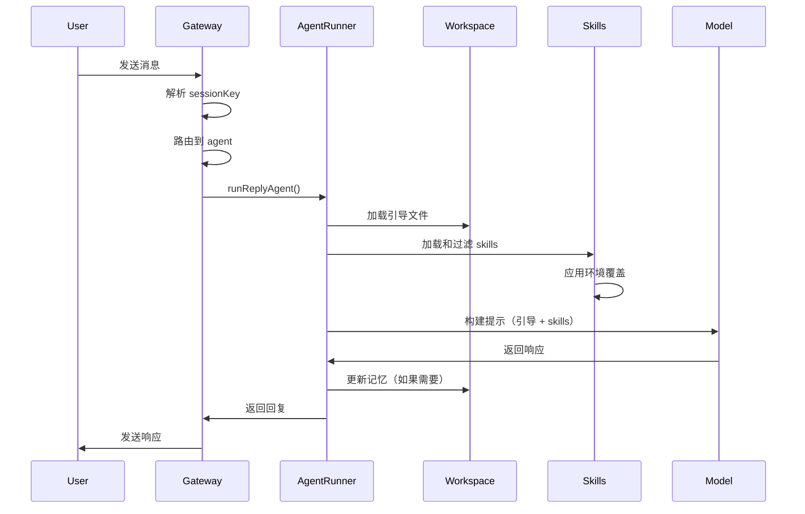

# OpenClaw 架构分析：Skills、Workspace 和 Agent 整合原理

## 目录
1. [核心概念](#核心概念)
2. [Skills（技能系统）](#skills技能系统)
3. [Workspace（工作空间）](#workspace工作空间)
4. [Agent（代理）](#agent代理)
5. [整合机制](#整合机制)
6. [数据流和生命周期](#数据流和生命周期)
7. [多代理架构](#多代理架构)
8. [技术实现细节](#技术实现细节)

---

## 核心概念

OpenClaw 是一个基于 AI 的自动化助手平台，核心架构围绕三个关键组件：

- **Skills（技能）**: 教会 AI 如何使用工具的知识库
- **Workspace（工作空间）**: AI 的"家"，存储记忆、配置和上下文
- **Agent（代理）**: 独立的 AI 实体，拥有自己的工作空间、会话和身份

### 关键设计原则

1. **隔离性**: 每个 agent 有独立的工作空间和会话存储
2. **可扩展性**: 通过 skills 系统动态扩展能力
3. **持久化**: 记忆和状态存储在文件系统中（Markdown）
4. **路由**: 基于通道（channel）的消息路由到对应的 agent

---

## Skills（技能系统）

### 什么是 Skills？

Skills 是符合 [AgentSkills](https://agentskills.io) 规范的目录，每个 skill 包含一个 `SKILL.md` 文件，用于：
- **教会 AI 如何使用特定工具**（如 CLI、API、服务）
- **定义工具的能力和使用方法**
- **控制工具的可见性和加载条件**

### Skills 的加载位置

Skills 从三个位置加载，按优先级排序：

```
<workspace>/skills (最高优先级)
    ↓
~/.openclaw/skills (管理的/本地的 skills)
    ↓
bundled skills (内置 skills，最低优先级)
```

**代码实现**：`src/agents/skills/workspace.ts`

```typescript
function loadSkillEntries(workspaceDir: string, opts?: {...}) {
  const bundledSkills = loadSkills({ dir: bundledSkillsDir, source: "openclaw-bundled" });
  const managedSkills = loadSkills({ dir: managedSkillsDir, source: "openclaw-managed" });
  const workspaceSkills = loadSkills({ dir: workspaceSkillsDir, source: "openclaw-workspace" });
  
  // 合并时，工作空间 skills 覆盖同名的其他 skills
  return mergeSkills([bundledSkills, extraSkills, managedSkills, workspaceSkills]);
}
```

### Skills 的结构

每个 skill 目录包含：

```
skills/
└── nano-banana-pro/
    ├── SKILL.md           # 主文件（YAML frontmatter + Markdown 指令）
    ├── scripts/           # 可选：辅助脚本
    └── references/        # 可选：参考文档
```

**SKILL.md 示例**：

```markdown
---
name: nano-banana-pro
description: Generate or edit images via Gemini 3 Pro Image
metadata: {
  "openclaw": {
    "emoji": "🖼️",
    "requires": { "bins": ["uv"], "env": ["GEMINI_API_KEY"] },
    "primaryEnv": "GEMINI_API_KEY"
  }
}
---

# 使用说明

用 `uv run` 调用 Python 脚本生成图像...
```

### Skills 的过滤（Gating）

**加载时过滤**：在运行时决定哪些 skills 可见

```typescript
// src/agents/skills/config.ts
function shouldIncludeSkill({ entry, config, eligibility }) {
  // 1. 检查 OS 平台
  if (metadata.os && !metadata.os.includes(platform)) return false;
  
  // 2. 检查二进制依赖
  if (requires.bins && !allBinsPresent()) return false;
  
  // 3. 检查环境变量
  if (requires.env && !envVarsPresent()) return false;
  
  // 4. 检查配置路径
  if (requires.config && !configPathsTruthy()) return false;
  
  // 5. 检查 enabled 标志
  if (config.skills?.entries?.[skillKey]?.enabled === false) return false;
  
  return true;
}
```

**过滤条件**：
- `metadata.openclaw.os`: 限制操作系统（`darwin`, `linux`, `win32`）
- `metadata.openclaw.requires.bins`: 必需的二进制文件
- `metadata.openclaw.requires.env`: 必需的环境变量
- `metadata.openclaw.requires.config`: 配置路径必须为真
- `skills.entries.<name>.enabled`: 手动启用/禁用

### Skills 的环境注入

每个 agent 运行时，OpenClaw 会：

1. 读取 skill 元数据
2. 注入 `skills.entries.<key>.env` 或 `skills.entries.<key>.apiKey` 到 `process.env`
3. 构建包含可用 skills 的系统提示
4. 运行结束后恢复原始环境

**代码位置**：`src/agents/skills/env-overrides.ts`

```typescript
export function applySkillEnvOverrides(snapshot: SkillSnapshot, config?: OpenClawConfig) {
  const originalEnv = { ...process.env };
  
  for (const entry of snapshot.entries) {
    const skillConfig = config?.skills?.entries?.[entry.skillKey];
    if (skillConfig?.env) {
      // 只有当环境变量不存在时才注入
      for (const [key, value] of Object.entries(skillConfig.env)) {
        if (!(key in process.env)) {
          process.env[key] = value;
        }
      }
    }
  }
  
  return originalEnv; // 返回用于恢复
}
```

### Skills 和 Agent 的关系

- **全局 skills** (`~/.openclaw/skills`): 所有 agents 共享
- **工作空间 skills** (`<workspace>/skills`): 特定 agent 专用
- **插件 skills**: 由插件提供，配置后加载

**多 agent 场景下**：

```json5
{
  "agents": {
    "list": [
      {
        "id": "support",
        "workspace": "~/.openclaw/workspace-support"
        // support 的 skills: ~/.openclaw/workspace-support/skills
      },
      {
        "id": "coding",
        "workspace": "~/.openclaw/workspace-coding"
        // coding 的 skills: ~/.openclaw/workspace-coding/skills
      }
    ]
  }
}
```

---

## Workspace（工作空间）

### 什么是 Workspace？

Workspace 是 agent 的"家"，存储：
- **记忆**（memory）
- **身份和行为规则**（AGENTS.md, SOUL.md）
- **工具配置**（TOOLS.md）
- **会话上下文**（通过文件系统）
- **技能**（skills/）

### 默认位置

```
~/.openclaw/workspace           # 默认位置
~/.openclaw/workspace-<profile> # 如果设置了 OPENCLAW_PROFILE
~/.openclaw/workspace-<agentId> # 多 agent 时非默认 agent 的位置
```

**配置方式**：

```json5
{
  "agents": {
    "defaults": {
      "workspace": "~/.openclaw/workspace"
    },
    "list": [
      {
        "id": "support",
        "workspace": "~/support-agent-workspace"
      }
    ]
  }
}
```

### Workspace 文件布局

```
~/.openclaw/workspace/
├── AGENTS.md         # Agent 操作指南和记忆使用规则
├── SOUL.md           # 角色、语气和边界
├── TOOLS.md          # 本地工具和惯例说明
├── IDENTITY.md       # Agent 名称、个性和 emoji
├── USER.md           # 用户信息和称呼方式
├── HEARTBEAT.md      # 心跳检查清单
├── BOOTSTRAP.md      # 首次运行仪式（运行后删除）
├── MEMORY.md         # 长期记忆（可选）
├── memory/           # 每日记忆日志
│   ├── 2026-02-01.md
│   └── 2026-02-02.md
├── skills/           # 工作空间特定的 skills
│   └── my-custom-skill/
│       └── SKILL.md
└── canvas/           # Canvas UI 文件（可选）
    └── index.html
```

**关键文件说明**：

| 文件 | 用途 | 加载时机 |
|------|------|---------|
| `AGENTS.md` | 操作指南，如何使用记忆 | 每个会话 |
| `SOUL.md` | 个性、语气、边界 | 每个会话 |
| `USER.md` | 用户是谁，如何称呼 | 每个会话 |
| `IDENTITY.md` | Agent 名称和风格 | 引导仪式时创建/更新 |
| `TOOLS.md` | 本地工具说明（不控制可用性） | 每个会话 |
| `HEARTBEAT.md` | 心跳运行的简短检查清单 | 心跳探测时 |
| `BOOT.md` | 网关重启时的启动清单 | 内部钩子启用时 |
| `BOOTSTRAP.md` | 首次运行的一次性仪式 | 仅全新工作空间 |
| `memory/YYYY-MM-DD.md` | 每日记忆日志（追加） | 会话启动时读取今天+昨天 |
| `MEMORY.md` | 精选的长期记忆 | 仅主会话（不在群组中） |

### Workspace 的创建和引导

**代码实现**：`src/agents/workspace.ts`

```typescript
export async function ensureAgentWorkspace(params?: {
  dir?: string;
  ensureBootstrapFiles?: boolean;
}): Promise<{...}> {
  const dir = resolveUserPath(params?.dir ?? DEFAULT_AGENT_WORKSPACE_DIR);
  await fs.mkdir(dir, { recursive: true });
  
  if (!params?.ensureBootstrapFiles) {
    return { dir };
  }
  
  // 加载模板
  const agentsTemplate = await loadTemplate(DEFAULT_AGENTS_FILENAME);
  const soulTemplate = await loadTemplate(DEFAULT_SOUL_FILENAME);
  // ... 其他模板
  
  // 只有文件不存在时才写入
  await writeFileIfMissing(agentsPath, agentsTemplate);
  await writeFileIfMissing(soulPath, soulTemplate);
  // ... 其他文件
  
  // 品牌新工作空间：初始化 git repo
  if (isBrandNewWorkspace) {
    await writeFileIfMissing(bootstrapPath, bootstrapTemplate);
    await ensureGitRepo(dir, isBrandNewWorkspace);
  }
  
  return { dir, agentsPath, soulPath, ... };
}
```

### Workspace 和 Agent 的关系

每个 agent 有自己的工作空间：

```typescript
// src/config/agent-dirs.ts
export function resolveAgentWorkspaceDir(cfg: OpenClawConfig, agentId: string) {
  const configured = resolveAgentConfig(cfg, agentId)?.workspace?.trim();
  if (configured) {
    return resolveUserPath(configured);
  }
  
  // 默认 agent 使用全局 workspace 配置
  const defaultAgentId = resolveDefaultAgentId(cfg);
  if (agentId === defaultAgentId) {
    const fallback = cfg.agents?.defaults?.workspace?.trim();
    if (fallback) {
      return resolveUserPath(fallback);
    }
    return DEFAULT_AGENT_WORKSPACE_DIR;
  }
  
  // 其他 agents 使用专用目录
  return path.join(os.homedir(), ".openclaw", `workspace-${agentId}`);
}
```

---

## Agent（代理）

### 什么是 Agent？

Agent 是一个独立的 AI 实体，拥有：
- **独立的工作空间**（Workspace）
- **独立的会话存储**（Session Store）
- **独立的身份和配置**（Identity、Model、Tools）
- **独立的认证配置**（Auth Profiles）

### Agent 配置

```json5
{
  "agents": {
    "defaults": {
      "workspace": "~/.openclaw/workspace",
      "model": "anthropic/claude-sonnet-4-20250514",
      "sandbox": { ... }
    },
    "list": [
      {
        "id": "main",           // Agent ID（必需）
        "name": "Skippy",       // 显示名称
        "default": true,        // 默认 agent
        "workspace": "~/.openclaw/workspace",
        "agentDir": "~/.openclaw/agents/main/agent", // 会话和状态目录
        "model": "anthropic/claude-sonnet-4-20250514",
        "memorySearch": { ... },
        "humanDelay": { ... },
        "heartbeat": { ... },
        "identity": { ... },
        "groupChat": { ... },
        "subagents": { ... },
        "sandbox": { ... },
        "tools": { ... }
      },
      {
        "id": "support",
        "name": "Support Bot",
        "workspace": "~/.openclaw/workspace-support",
        "model": "openai/gpt-4o"
      }
    ]
  }
}
```

### Agent ID 规范化

```typescript
// src/routing/session-key.ts
export function normalizeAgentId(raw?: string): string {
  const trimmed = (raw ?? DEFAULT_AGENT_ID).trim().toLowerCase();
  return trimmed || DEFAULT_AGENT_ID;
}

export const DEFAULT_AGENT_ID = "main";
```

### Agent 目录结构

每个 agent 的状态存储在：

```
~/.openclaw/
├── agents/
│   ├── main/
│   │   └── agent/
│   │       ├── auth-profiles.json      # 认证配置
│   │       ├── sessions/
│   │       │   ├── sessions.json       # 会话元数据
│   │       │   └── *.jsonl             # 会话转录日志
│   │       └── memory-index/           # 向量记忆索引
│   ├── support/
│   │   └── agent/
│   │       └── ...
│   └── coding/
│       └── agent/
│           └── ...
└── workspace             # 默认 agent 的工作空间
└── workspace-support     # support agent 的工作空间
└── workspace-coding      # coding agent 的工作空间
```

### Agent 路由

**路由决策流程**：`src/routing/session-key.ts` 和 `docs/concepts/channel-routing.md`

```
1. Exact peer match (bindings with peer.kind + peer.id)
   ↓
2. Guild match (Discord guildId)
   ↓
3. Team match (Slack teamId)
   ↓
4. Account match (accountId on channel)
   ↓
5. Channel match (any account on that channel)
   ↓
6. Default agent (agents.list[].default, else first entry, fallback to "main")
```

**Session Key 格式**：

```
agent:<agentId>:<channel>:<contextType>:<contextId>
```

**示例**：

```
agent:main:main                                      # 默认 agent 的主会话
agent:support:telegram:group:-1001234567890          # Telegram 群组
agent:main:discord:channel:123456:thread:987654      # Discord 线程
agent:coding:slack:channel:C123456                   # Slack 频道
```

---

## 整合机制

### 1. Agent 启动流程



### 2. 提示构建流程

**代码实现**：`src/agents/pi-embedded.ts`

```typescript
async function queueEmbeddedPiMessage(params: {
  message: string;
  agentId: string;
  config: OpenClawConfig;
  // ...
}) {
  // 1. 解析 workspace 目录
  const workspaceDir = resolveAgentWorkspaceDir(params.config, params.agentId);
  
  // 2. 加载引导文件
  const bootstrapFiles = await loadWorkspaceBootstrapFiles(workspaceDir);
  const filteredFiles = filterBootstrapFilesForSession(bootstrapFiles, params.sessionKey);
  
  // 3. 构建 skills 快照
  const skillSnapshot = buildWorkspaceSkillSnapshot({
    workspaceDir,
    config: params.config,
    eligibility: { platform, env, ... }
  });
  
  // 4. 应用 skill 环境覆盖
  const originalEnv = applySkillEnvOverridesFromSnapshot(skillSnapshot, params.config);
  
  // 5. 构建 skills 提示
  const skillsPrompt = buildWorkspaceSkillsPrompt(skillSnapshot);
  
  // 6. 构建最终系统提示
  const systemPrompt = [
    ...filteredFiles.map(f => f.content),
    skillsPrompt,
    params.systemPromptAppend
  ].join('\n\n');
  
  // 7. 调用模型
  const result = await runEmbeddedPiAgent({
    message: params.message,
    systemPrompt,
    workspaceDir,
    sessionDir,
    // ...
  });
  
  // 8. 恢复环境
  restoreEnv(originalEnv);
  
  return result;
}
```

### 3. Skills 提示格式

Skills 被注入到系统提示中，格式如下：

```xml
<skills count="3">
<skill>
  <name>nano-banana-pro</name>
  <description>Generate or edit images via Gemini 3 Pro Image</description>
  <location>/Users/user/.openclaw/workspace/skills/nano-banana-pro</location>
</skill>
<skill>
  <name>github</name>
  <description>GitHub CLI operations (issues, PRs, repos)</description>
  <location>/opt/homebrew/lib/node_modules/openclaw/dist/skills/github</location>
</skill>
<skill>
  <name>coding-agent</name>
  <description>Run Codex CLI, Claude Code, or Pi Coding Agent</description>
  <location>/opt/homebrew/lib/node_modules/openclaw/dist/skills/coding-agent</location>
</skill>
</skills>
```

**Token 开销**：

```
总字符数 = 195 + Σ(97 + len(name_escaped) + len(description_escaped) + len(location_escaped))
```

**代码位置**：`@mariozechner/pi-coding-agent` 的 `formatSkillsForPrompt()`

### 4. 记忆系统整合

**记忆文件加载**：

```typescript
// src/hooks/bundled/session-memory/handler.ts
async function loadMemoryContext(params: {
  workspaceDir: string;
  sessionKey: string;
  config: OpenClawConfig;
}) {
  const memoryDir = path.join(workspaceDir, "memory");
  const today = new Date().toISOString().slice(0, 10);
  const yesterday = new Date(Date.now() - 86400000).toISOString().slice(0, 10);
  
  const todayFile = path.join(memoryDir, `${today}.md`);
  const yesterdayFile = path.join(memoryDir, `${yesterday}.md`);
  
  const todayContent = await safeReadFile(todayFile);
  const yesterdayContent = await safeReadFile(yesterdayFile);
  
  return [todayContent, yesterdayContent].filter(Boolean).join('\n\n---\n\n');
}
```

**自动记忆刷新**：

在会话接近自动压缩时，OpenClaw 会触发一个静默的代理回合，提醒模型在上下文压缩之前写入持久记忆：

```typescript
// src/auto-reply/reply/agent-runner-memory.ts
export async function runMemoryFlushIfNeeded(params: {
  sessionEntry: SessionEntry;
  config: OpenClawConfig;
  // ...
}) {
  const compactionConfig = params.config.agents?.defaults?.compaction;
  const memoryFlushConfig = compactionConfig?.memoryFlush;
  
  if (!memoryFlushConfig?.enabled) return;
  
  const contextTokens = lookupContextTokens(...);
  const reserveTokens = compactionConfig.reserveTokensFloor ?? 20000;
  const softThreshold = memoryFlushConfig.softThresholdTokens ?? 4000;
  const flushThreshold = contextTokens - reserveTokens - softThreshold;
  
  if (params.sessionEntry.estimatedTokens >= flushThreshold) {
    // 触发记忆刷新回合
    await queueEmbeddedPiMessage({
      message: memoryFlushConfig.prompt,
      systemPromptAppend: memoryFlushConfig.systemPrompt,
      isMemoryFlush: true,
      // ...
    });
  }
}
```

---

## 数据流和生命周期

### 消息处理完整流程

```
1. 消息到达 Gateway
   ↓
2. 路由解析（channel → accountId → peer → sessionKey → agentId）
   ↓
3. 加载 Agent 配置
   - resolveAgentConfig(config, agentId)
   - resolveAgentWorkspaceDir(config, agentId)
   - resolveAgentDir(config, agentId)
   ↓
4. 加载 Workspace 引导文件
   - AGENTS.md, SOUL.md, USER.md, TOOLS.md, IDENTITY.md
   - memory/YYYY-MM-DD.md (今天 + 昨天)
   - MEMORY.md (仅主会话)
   ↓
5. 构建 Skills 快照
   - 扫描 <workspace>/skills, ~/.openclaw/skills, bundled skills
   - 应用过滤规则（OS, bins, env, config）
   - 去重和合并（工作空间优先）
   ↓
6. 应用 Skill 环境覆盖
   - 注入 skills.entries.<key>.env
   - 注入 skills.entries.<key>.apiKey
   ↓
7. 构建系统提示
   - 引导文件内容
   - Skills XML
   - 额外的系统提示追加
   ↓
8. 加载会话历史
   - 从 sessions.json 读取元数据
   - 从 <sessionKey>.jsonl 加载转录
   ↓
9. 调用模型
   - 运行嵌入的 Pi Agent（@mariozechner/pi-coding-agent）
   - 流式响应处理（如果启用）
   - 工具调用执行
   ↓
10. 更新会话状态
   - 追加消息到 <sessionKey>.jsonl
   - 更新 sessions.json 元数据（token 估算、压缩计数）
   ↓
11. 记忆刷新检查
   - 如果接近压缩阈值，触发记忆刷新回合
   ↓
12. 恢复环境
   - 移除 skill 环境变量覆盖
   ↓
13. 返回响应到 Gateway
   ↓
14. Gateway 发送回复到原始通道
```

### Session 生命周期

**Session Key 结构**：

```
agent:<agentId>:<channel>:<contextType>:<contextId>[:thread:<threadId>]
```

**Session 元数据**：`~/.openclaw/agents/<agentId>/sessions/sessions.json`

```json5
{
  "agent:main:telegram:group:-1001234567890": {
    "sessionKey": "agent:main:telegram:group:-1001234567890",
    "createdAt": "2026-02-01T10:00:00Z",
    "updatedAt": "2026-02-02T15:30:00Z",
    "estimatedTokens": 15000,
    "compactionCount": 0,
    "lastCompactionAt": null,
    "memoryFlushCompletedAt": null,
    "metadata": { ... }
  }
}
```

**Session 转录**：`~/.openclaw/agents/<agentId>/sessions/<sessionKey>.jsonl`

```jsonl
{"role":"user","content":"Hello!","timestamp":"2026-02-02T15:30:00Z"}
{"role":"assistant","content":"Hi there!","timestamp":"2026-02-02T15:30:05Z"}
{"role":"user","content":"How are you?","timestamp":"2026-02-02T15:31:00Z"}
{"role":"assistant","content":"I'm doing great!","timestamp":"2026-02-02T15:31:03Z"}
```

### Skills 生命周期

**Skills 快照时机**：

- **会话启动时**：构建 skills 快照并缓存
- **文件监视触发时**：当 `SKILL.md` 变化时刷新（如果启用 `skills.load.watch`）
- **远程节点出现时**：当新的 macOS 节点连接时刷新（Linux Gateway）

**代码实现**：`src/agents/skills/workspace.ts`

```typescript
export function buildWorkspaceSkillSnapshot(params: {
  workspaceDir: string;
  config?: OpenClawConfig;
  skillFilter?: string[];
  eligibility?: SkillEligibilityContext;
}): SkillSnapshot {
  // 1. 加载所有 skill 条目
  const entries = loadWorkspaceSkillEntries(params.workspaceDir, {
    config: params.config,
    // ...
  });
  
  // 2. 过滤可见的 skills
  const filtered = filterWorkspaceSkillEntries(
    entries,
    params.config,
    params.skillFilter,
    params.eligibility,
  );
  
  // 3. 构建命令规范（用于斜杠命令）
  const commands = buildWorkspaceSkillCommandSpecs(filtered);
  
  return {
    entries: filtered,
    commands,
    snapshotAt: Date.now(),
  };
}
```

---

## 多代理架构

### 配置示例

```json5
{
  "agents": {
    "defaults": {
      "workspace": "~/.openclaw/workspace",
      "model": "anthropic/claude-sonnet-4-20250514"
    },
    "list": [
      {
        "id": "main",
        "name": "Skippy",
        "default": true,
        "workspace": "~/.openclaw/workspace"
      },
      {
        "id": "support",
        "name": "Support Bot",
        "workspace": "~/.openclaw/workspace-support",
        "model": "openai/gpt-4o"
      },
      {
        "id": "coding",
        "name": "Code Assistant",
        "workspace": "~/.openclaw/workspace-coding",
        "model": "anthropic/claude-sonnet-4-20250514"
      }
    ]
  },
  "bindings": [
    // Telegram support group → support agent
    {
      "match": {
        "channel": "telegram",
        "peer": { "kind": "group", "id": "-100123456789" }
      },
      "agentId": "support"
    },
    // Slack #engineering channel → coding agent
    {
      "match": {
        "channel": "slack",
        "teamId": "T123456",
        "channelId": "C789012"
      },
      "agentId": "coding"
    },
    // Discord guild → coding agent
    {
      "match": {
        "channel": "discord",
        "guildId": "987654321"
      },
      "agentId": "coding"
    }
  ]
}
```

### 隔离机制

每个 agent 完全隔离：

| 资源 | main agent | support agent | coding agent |
|------|-----------|--------------|--------------|
| Workspace | `~/.openclaw/workspace` | `~/.openclaw/workspace-support` | `~/.openclaw/workspace-coding` |
| Agent Dir | `~/.openclaw/agents/main/agent` | `~/.openclaw/agents/support/agent` | `~/.openclaw/agents/coding/agent` |
| Sessions | `agents/main/agent/sessions/` | `agents/support/agent/sessions/` | `agents/coding/agent/sessions/` |
| Skills | `workspace/skills` + `~/.openclaw/skills` + bundled | `workspace-support/skills` + `~/.openclaw/skills` + bundled | `workspace-coding/skills` + `~/.openclaw/skills` + bundled |
| Memory | `workspace/memory/`, `workspace/MEMORY.md` | `workspace-support/memory/`, `workspace-support/MEMORY.md` | `workspace-coding/memory/`, `workspace-coding/MEMORY.md` |
| Auth | `agents/main/agent/auth-profiles.json` | `agents/support/agent/auth-profiles.json` | `agents/coding/agent/auth-profiles.json` |

### Broadcast Groups（广播组）

让多个 agents 对同一个对等体（peer）做出响应：

```json5
{
  "broadcast": {
    "strategy": "parallel",  // 或 "sequential"
    "120363403215116621@g.us": ["alfred", "baerbel"],
    "+15555550123": ["support", "logger"]
  }
}
```

**执行流程**：

```
1. 消息到达 WhatsApp 群组 120363403215116621@g.us
   ↓
2. Gateway 检测到 broadcast 配置
   ↓
3. 并行执行（parallel 策略）：
   - alfred agent 处理消息 → 返回回复 A
   - baerbel agent 处理消息 → 返回回复 B
   ↓
4. 两个回复都发送到群组
```

---

## 技术实现细节

### 依赖注入

OpenClaw 使用依赖注入模式（虽然没有显式的 `createDefaultDeps`，但模式类似）：

```typescript
// 示例：Agent Runner 的依赖
interface AgentRunnerDeps {
  config: OpenClawConfig;
  workspaceDir: string;
  agentDir: string;
  sessionStore: Record<string, SessionEntry>;
  storePath: string;
  modelResolver: ModelResolver;
  toolExecutor: ToolExecutor;
}
```

### Pi Coding Agent 集成

OpenClaw 使用 `@mariozechner/pi-coding-agent` 作为核心 agent 运行时：

```typescript
// src/agents/pi-embedded.ts
import { runEmbeddedPiAgent } from '@mariozechner/pi-coding-agent';

await runEmbeddedPiAgent({
  message: userMessage,
  systemPrompt: buildSystemPrompt(...),
  workspaceDir: agentWorkspace,
  sessionDir: agentSessionDir,
  provider: resolvedProvider,
  model: resolvedModel,
  contextTokens: contextWindow,
  onToolCall: handleToolCall,
  onMessage: handleStreamingMessage,
  // ...
});
```

**Pi Agent 提供**：
- 会话管理和压缩
- 工具调用（MCP 工具协议）
- 流式响应处理
- 上下文窗口管理

### 沙箱支持

OpenClaw 支持沙箱执行（Docker 容器）：

```json5
{
  "agents": {
    "defaults": {
      "sandbox": {
        "enabled": true,
        "workspaceAccess": "ro",  // "rw", "ro", "none"
        "workspaceRoot": "~/.openclaw/sandboxes",
        "docker": {
          "image": "node:22-alpine",
          "setupCommand": "apk add --no-cache git python3 ..."
        }
      }
    }
  }
}
```

**沙箱工作空间映射**：

- `workspaceAccess: "rw"`: 主机工作空间挂载为读写
- `workspaceAccess: "ro"`: 主机工作空间挂载为只读
- `workspaceAccess: "none"`: 使用沙箱专用工作空间 `~/.openclaw/sandboxes/<sessionKey>`

**Skills 和沙箱**：

- Skill 的 `requires.bins` 在主机上检查（加载时）
- 二进制文件也必须存在于容器内（运行时）
- 通过 `sandbox.docker.setupCommand` 安装沙箱依赖

### 工具执行

工具通过 MCP（Model Context Protocol）执行：

```typescript
// 工具调用示例
{
  "name": "bash",
  "arguments": {
    "command": "uv run python scripts/generate_image.py --prompt 'sunset'",
    "workdir": "/Users/user/.openclaw/workspace/skills/nano-banana-pro",
    "pty": true
  }
}
```

**工具类型**：
- **内置工具**：`bash`, `read`, `write`, `list_files`, `grep`, ...
- **Skill 工具**：通过 skills 教会 AI 使用的 CLI/API
- **插件工具**：由插件提供的自定义工具

### 性能优化

1. **Skills 快照缓存**：会话启动时构建，避免每回合重新加载
2. **环境变量作用域**：仅在 agent 运行期间注入，之后恢复
3. **增量会话加载**：使用 JSONL 格式，支持流式追加
4. **记忆索引**：使用 sqlite-vec 加速向量搜索
5. **并行加载**：引导文件和 skills 并行加载

### 错误处理

1. **Skills 加载失败**：跳过该 skill，记录警告，继续加载其他 skills
2. **工具执行失败**：返回错误给 agent，让 agent 决定如何处理
3. **会话损坏**：尝试重置会话（删除转录，重新开始）
4. **记忆刷新失败**：重试（带退避），如果仍失败则跳过压缩周期

---

## 总结

### 核心设计原则

1. **文件系统优先**：状态存储在文件系统（Markdown、JSON、JSONL），便于备份、版本控制和调试
2. **声明式配置**：通过 JSON 配置文件控制行为，避免硬编码
3. **模块化**：Skills、Workspace、Agent 独立但紧密整合
4. **隔离性**：多 agent 完全隔离，共享资源通过配置明确控制
5. **可观察性**：会话转录、日志、诊断事件，便于调试和审计

### 扩展点

1. **Skills 开发**：创建新的 `SKILL.md` 文件，教会 AI 使用新工具
2. **插件系统**：通过 `openclaw.plugin.json` 扩展核心功能
3. **工具注册**：通过 MCP 协议注册自定义工具
4. **记忆插件**：替换默认的 `memory-core` 插件
5. **通道路由**：自定义 bindings 规则，将消息路由到特定 agents

### 最佳实践

1. **工作空间备份**：使用私有 Git 仓库备份工作空间
2. **Skills 隔离**：特定用途的 skills 放在工作空间 `skills/` 中
3. **多 Agent 分离**：不同角色/场景使用不同 agents
4. **记忆维护**：定期审查和整理 `MEMORY.md` 和 `memory/*.md`
5. **配置版本控制**：`~/.openclaw/openclaw.json` 纳入版本控制（去除敏感信息）

---

**生成时间**: 2026-02-02  
**作者**: Claude (Anthropic)  
**基于**: OpenClaw 代码库分析
